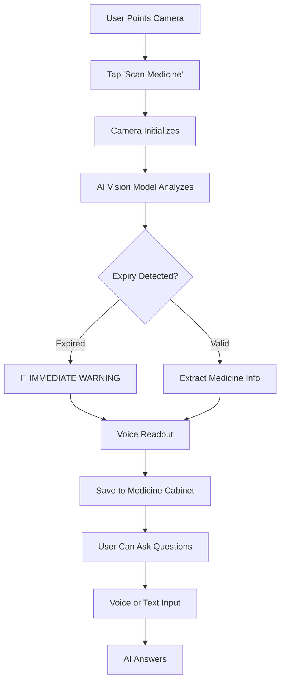

# SightSage 👁️🗣️
## Voice-First Medicine Scanner for Elderly & Visually Impaired

## 🌟 **Overview**

**SightSage** is an innovative, voice-first Progressive Web App (PWA) designed specifically for **elderly and visually impaired users**. It leverages **Groq's powerful Llama 4 Scout 17B vision model** to identify medicines, check expiry dates, detect dangerous interactions, and provide emergency assistance - all through simple voice commands.

### 🎯 **Problem Statement**
Millions of elderly and visually impaired individuals struggle to:
- Read small text on medicine labels
- Track expiry dates
- Identify potential drug interactions
- Access emergency medication information quickly

### 💡 **Our Solution**
SightSage replaces visual reading with **voice + AI**, making medicine management accessible, safe, and dignified for everyone.

> *"Just point, ask, and let SightSage be your medicine companion."*

---

## ✨ **Key Features (24+)**

### 📸 **Smart Medicine Scanning** *(Features 1-6)*
| # | Feature | How It Works |
|---|---------|--------------|
| 1 | **Instant Medicine Recognition** | Point camera at any packaging - AI identifies the medicine instantly |
| 2 | **Expiry Date Extraction** | Automatically detects "EXP" or expiry dates with visual alerts |
| 3 | **Active Ingredients** | Lists all active ingredients in plain English |
| 4 | **Physical Description** | Identifies color, shape, markings for visual verification |
| 5 | **Dosage Information** | Extracts recommended dosage when visible |
| 6 | **Safety Warnings** | Highlights contraindications and special precautions |

### 🔍 **Medicine Comparison** *(Features 7-10)*
| # | Feature | How It Works |
|---|---------|--------------|
| 7 | **Interaction Detection** | Compares two medicines for dangerous interactions |
| 8 | **Shared Ingredients** | Identifies overlapping active ingredients |
| 9 | **Risk Assessment** | Color-coded warnings: 🔴 Critical / 🟡 Caution / 🟢 Safe |
| 10 | **Dosage Spacing** | Recommends time gaps between medicines |

### 🗣️ **Voice-First Interface** *(Features 11-14)*
| # | Feature | How It Works |
|---|---------|--------------|
| 11 | **Voice Commands** | "Scan this", "Read warnings", "Compare medicines" |
| 12 | **Voice Feedback** | Results automatically read aloud |
| 13 | **Continuous Listening** | 10-second active listening window |
| 14 | **Text Fallback** | Type questions when voice isn't suitable |

### 🆘 **Emergency Features** *(Features 15-18)*
| # | Feature | How It Works |
|---|---------|--------------|
| 15 | **SOS Button** | One-tap emergency access |
| 16 | **Triple-Tap Detection** | Tap anywhere 3x quickly for emergency mode |
| 17 | **Medicine History** | Shows all recent medicines with expiry status |
| 18 | **Emergency Report** | Ready-to-show doctor with medicine list + timestamp |

### 💊 **Medicine Cabinet** *(Features 19-21)*
| # | Feature | How It Works |
|---|---------|--------------|
| 19 | **Auto-History** | Last 10 medicines automatically saved to localStorage |
| 20 | **Expiry Tracking** | Visual alerts for expired medicines in dropdown |
| 21 | **Quick Access** | Dropdown to view any previously scanned medicine |

### ♿ **Accessibility First** *(Features 22-24)*
| # | Feature | How It Works |
|---|---------|--------------|
| 22 | **High Contrast Mode** | Yellow text on black - maximum readability (WCAG AAA) |
| 23 | **Large Text Mode** | 200% text size toggle |
| 24 | **Adjustable Voice Speed** | 5 speeds (0.5x to 1.5x) |

---

## 🎥 **How It Works**



### **Simple 3-Step Process:**
1. **Point** your phone camera at any medicine
2. **Tap** "Scan Medicine" (or say "Scan")
3. **Listen** as SightSage reads the information aloud

---

## 🛠️ **Technology Stack**

### **Core Architecture**
```
┌─────────────────────────────────────┐
│         Frontend (HTML/CSS/JS)      │
├─────────────────────────────────────┤
│         Web Speech API              │
├─────────────────────────────────────┤
│         MediaDevices API            │
├─────────────────────────────────────┤
│         Groq Llama 4 Scout 17B      │
├─────────────────────────────────────┤
│         localStorage (Cabinet)      │
└─────────────────────────────────────┘
```

### **Detailed Stack**
| Layer | Technology | Purpose |
|-------|------------|---------|
| **AI Engine** | [Groq Llama 4 Scout 17B](https://groq.com) | Vision + Text analysis |
| **Frontend** | HTML5, CSS3, JavaScript (ES6+) | Progressive Web App |
| **Voice Input** | Web Speech API (SpeechRecognition) | Voice commands |
| **Voice Output** | Speech Synthesis API | Voice feedback |
| **Camera** | MediaDevices API + WebRTC | Real-time scanning |
| **Storage** | localStorage | Medicine cabinet history |
| **PWA** | Service Workers + Manifest.json | Offline capability |
| **Styling** | CSS3 with Glassmorphism | Visual design |
| **Fonts** | Lora (headings) + Hind (body) | Typography |

### **Key Integrations**
- **Groq API** - Ultra-fast inference (< 2 seconds per scan)
- **Llama 4 Scout** - 17B parameter vision-language model
- **WebRTC** - Camera streaming with fallback constraints
- **Web Speech** - Cross-browser voice recognition

---

## 🔧 **Installation & Setup**

### **Prerequisites**
- Modern browser (Chrome 80+, Safari 14+, Edge 80+, Firefox 85+)
- HTTPS server (or localhost for development)
- Groq API key (replace the demo key for production)

### **Quick Start (5 Minutes)**

```bash
# 1. Clone the repository
git clone https://github.com/yourusername/sightsage.git
cd sightsage

# 2. Get a Groq API Key
# Visit: https://console.groq.com
# Sign up and create an API key

# 3. Configure the API key
# Open app.js and replace line 11:
# this.API_KEY = 'your-groq-api-key-here';

# 4. Serve the files locally
# Using Python:
python -m http.server 8000

# OR using Node.js:
npx http-server

# 5. Open in browser
# http://localhost:8000
```

### **Environment Variables (Production)**
```javascript
// For Vercel/Netlify deployment
const isVercel = typeof process !== 'undefined' && process.env.GROQ_API_KEY;
// Set GROQ_API_KEY in your hosting platform's environment variables
```

### **File Structure**
```
sightsage/
├── index.html          # Main application shell
├── styles.css          # All styling + glassmorphism effects
├── app.js              # Complete application logic (500+ lines)
├── manifest.json       # PWA configuration
├── sw.js               # Service Worker for offline
├── camera-debug.html   # Camera troubleshooting tool
├── .hintrc             # Webhint configuration
└── README.md           # Documentation
```

---

## 🤖 **How the AI Works**

### **1. Context Capture**
The app captures the camera frame and converts it to base64 image data.

### **2. Instruction Injection**
The `analyzeWithGroq()` function sends a carefully crafted prompt to the Llama 4 Scout model:

```javascript
const prompt = `You are SightSage, a caring medicine assistant. 
Look at this medicine image and tell me about it.

⚠️ CRITICAL RULE: If the expiry date has passed OR is older than today's date, 
your VERY FIRST WORDS MUST BE "DO NOT TAKE THIS MEDICINE - IT HAS EXPIRED".

Provide the following information:
MEDICINE NAME: [exact name from packaging]
EXPIRY DATE: [exact date if visible, or "NOT VISIBLE"]
APPEARANCE: [color, shape, markings]
USES: [what it's commonly used for]
HOW TO TAKE: [with/without food, any special instructions]
COMMON SIDE EFFECTS: [brief list]
ELDERLY ADVICE: [special considerations for elderly]
HEART PATIENTS: [what heart patients should know]
AVOID: [foods, drinks, or medicines to avoid]
SAFETY TIP: [one practical tip]`;
```

### **3. Conditional Logic**
The AI's response is post-processed to:
- **Detect expiry** - If expired, triggers emergency warning
- **Parse medicine name** - Extracts for cabinet storage
- **Check for unclear images** - Detects phrases like "can't see clearly"

### **4. Strict Formatting**
The AI is instructed to use **natural language** rather than markdown, ensuring the voice output sounds human.

### **5. API Limits & Optimization**
- **Model**: `meta-llama/llama-4-scout-17b-16e-instruct`
- **Temperature**: 0.4 (balances creativity and accuracy)
- **Max tokens**: 800 (sufficient for medicine details)
- **Image quality**: 0.85 JPEG compression (balances quality and speed)

---

## 📱 **PWA Installation**

SightSage works on any device with a browser and can be installed for offline use:

### **Android (Chrome)**
1. Open SightSage in Chrome
2. Tap menu (3 dots) → "Add to Home screen"
3. Name it "SightSage" → Tap "Add"
4. App appears on home screen with icon

### **iOS (Safari)**
1. Open SightSage in Safari
2. Tap Share button → "Add to Home Screen"
3. Name it → Tap "Add"
4. Opens in full-screen mode like native app

### **Desktop (Chrome/Edge)**
1. Click install icon in address bar
2. Click "Install"
3. Launches in its own window

### **Offline Capabilities**
- Service Worker caches core files
- Medicine cabinet available offline
- Camera requires internet for AI analysis

---

## 🎥 **Project Demo**

### **Live Demo**
[](https://sightsage.vercel.app)

### **Video Walkthrough**
[](https://youtu.be/your-demo-link)

### **Screenshots**

| Scanning | Results | Emergency |
|----------|---------|-----------|
|  |  |  |

---

## 📸 **Camera Debugging**

Having camera issues? We've included a comprehensive diagnostic tool:

### **Access Camera Debug**
Open `camera-debug.html` in your browser

### **5-Step Diagnostic Process**
| Step | Action | What It Tests |
|------|--------|---------------|
| **Step 1** | Check API | Verifies `navigator.mediaDevices` availability |
| **Step 2** | List Devices | Enumerates all cameras on device |
| **Step 3** | Open Camera | Tests `environment` facingMode |
| **Step 3b** | Fallback | Tests with no constraints |
| **Step 4** | Capture Frame | Draws video frame to canvas |
| **Step 5** | Check Image Data | Verifies frame isn't blank |

### **Common Camera Fixes**
```javascript
// If facingMode: 'environment' fails, app automatically falls back to:
{ video: true }

// If camera doesn't initialize, check:
1. HTTPS required (camera needs secure context)
2. Browser permissions (🔒 icon in address bar)
3. No other apps using camera
4. Device has camera hardware
```

---

## ♿ **Accessibility Features**

### **Visual Accessibility**
| Feature | Implementation | Benefit |
|---------|---------------|---------|
| **High Contrast** | CSS variable override | Yellow on black (21:1 contrast) |
| **Large Text** | `body.large-text { font-size: 20px; }` | 200% text size |
| **Focus Indicators** | `:focus-visible` styling | Keyboard navigation |
| **Color Independence** | Icons + text labels | No reliance on color alone |

### **Auditory Accessibility**
| Feature | Implementation | Benefit |
|---------|---------------|---------|
| **Voice Commands** | Web Speech API | Hands-free operation |
| **Voice Feedback** | Speech Synthesis | Results read aloud |
| **Adjustable Speed** | 0.5x to 1.5x | User preference |
| **SOS Alerts** | Distinctive audio | Emergency awareness |

### **Motor Accessibility**
| Feature | Implementation | Benefit |
|---------|---------------|---------|
| **Triple-Tap SOS** | Tap counter anywhere | Quick emergency access |
| **Large Buttons** | 52px minimum touch target | Easy tapping |
| **Voice Alternative** | No typing needed | For limited mobility |

### **Cognitive Accessibility**
| Feature | Implementation | Benefit |
|---------|---------------|---------|
| **Simple Language** | AI instructed for plain English | Easy understanding |
| **Consistent Layout** | Grid-based design | Predictable navigation |
| **Clear Warnings** | Expiry alerts first | Immediate attention |
| **Step-by-Step** | "How to Use" card | Learning support |

---

## 🧠 **How the AI Generates Content**

The "Brain" of the app (`app.js`) uses **Conditional Prompt Engineering** to transform medicine labels into accessible information.

### **1. Context Capture**
The `analyzeWithGroq()` function captures:
- Camera frame as base64 image
- No prior context (fresh analysis each time)

### **2. Instruction Injection**
The prompt injects specific "Rules of Engagement":

**Expiry Priority Logic:**
> "If the expiry date has passed, your VERY FIRST WORDS MUST BE 'DO NOT TAKE THIS MEDICINE - IT HAS EXPIRED'"

**Structure Requirements:**
> "Provide the following information in a clear, structured way: MEDICINE NAME, EXPIRY DATE, APPEARANCE, USES..."

**Clarity Guidelines:**
> "Be direct and factual... Use simple words, short sentences, and a warm tone."

### **3. Natural Language Processing**
Unlike markdown-heavy outputs, the AI is instructed to:
- Write naturally like speaking to someone
- Avoid medical jargon
- Explain complex terms
- Be honest about uncertainty

### **4. Post-Processing**
```javascript
// Expiry detection
if (medicineInfo.expiry && this.isExpired(medicineInfo.expiry)) {
    this.showEmergency('⚠️ EXPIRED MEDICINE - DO NOT TAKE');
}

// Medicine name extraction
extractMedicineName(analysis) {
    // Check for unclear patterns first
    const unclearPatterns = ["can't see", "cannot see", "unclear"];
    // Then look for quoted names or capitalized terms
}
```

### **5. Storage & Retrieval**
Medicine data is parsed and stored in localStorage:
```javascript
cabinet.unshift({
    name: medicine.name || 'Unknown',
    expiry: medicine.expiry || null,
    description: medicine.description,
    scannedAt: new Date().toISOString(),
    expired: medicine.expiry ? this.isExpired(medicine.expiry) : false
});
```

---

## 📊 **API Usage & Limits**

### **Groq API Configuration**
```javascript
this.API_KEY = 'gsk_...'; // Your key here
this.API_URL = 'https://api.groq.com/openai/v1/chat/completions';
this.VISION_MODEL = 'meta-llama/llama-4-scout-17b-16e-instruct';
this.TEXT_MODEL = 'llama-3.3-70b-versatile';
```

### **Rate Limits (Free Tier)**
- **Requests per minute**: ~30
- **Tokens per minute**: ~5,000
- **Image size limit**: ~20MB (we use 0.85 quality JPEG)

### **Optimization Strategies**
1. **Image compression**: JPEG at 0.85 quality
2. **Token limit**: 800 tokens (faster response)
3. **Temperature**: 0.4 (balanced)
4. **Caching**: Medicine cabinet uses localStorage

### **Error Handling**
```javascript
if (!response.ok) {
    const errorBody = await response.text();
    throw new Error(`API error ${response.status}: ${errorBody}`);
}
// Fallback: return user-friendly error message
```

---

## 🚧 **Future Roadmap**

### **Phase 2 (Next 3 months)**
- [ ] **Multi-language support** (Hindi, Tamil, Bengali, Telugu)
- [ ] **Barcode scanning** for instant database lookup
- [ ] **Cloud sync** for medicine cabinet across devices
- [ ] **Medicine reminders** with voice notifications
- [ ] **Offline mode** with cached medicine database

### **Phase 3 (6 months)**
- [ ] **Wearable integration** (Apple Watch, Wear OS)
- [ ] **Doctor sharing** - send medicine list via QR code
- [ ] **AI health assistant** - answer medication questions
- [ ] **Family sharing** - caregivers get alerts
- [ ] **Medicine interaction database** (local storage)

### **Phase 4 (12 months)**
- [ ] **Regional language voice commands**
- [ ] **Telemedicine integration** (book appointments)
- [ ] **Insurance card scanning**
- [ ] **Prescription refill reminders**
- [ ] **Voice biometrics** for personalized profiles

---

## 👥 **Our Team**

| Name | Role | Contribution |
|------|------|--------------|
| **Your Name** | Lead Developer | Full-stack development, AI integration |
| **Team Member 2** | UI/UX Designer | Accessibility design, glassmorphism |
| **Team Member 3** | AI Specialist | Prompt engineering, Groq optimization |
| **Team Member 4** | Testing & QA | Cross-browser testing, user feedback |

---

## 📝 **Important Notes**

### **API Usage & Limits**
This app uses the **Groq Llama 4 Scout Free Tier**.

- **Rate Limits**: ~30 requests per minute. If you receive rate limit errors, wait 60 seconds.
- **Security**: The demo API key is included for hackathon evaluation. For production, replace with your own key and restrict it in Google Cloud Console.
- **Monitoring**: Usage is tracked. Excessive calls may be throttled.

### **Best Performance**
| For best results | Do this |
|-----------------|---------|
| **Medicine scanning** | Hold 15-20 cm from camera, good lighting |
| **Expiry detection** | Ensure "EXP" or date is clearly visible |
| **Voice commands** | Quiet environment, speak clearly |
| **Comparison** | Scan medicines one at a time |

### **Known Limitations**
- Camera requires HTTPS (not http)
- Voice recognition works best in Chrome/Edge
- Expiry detection depends on label clarity
- Internet connection required for AI analysis

### **Disclaimer**
> SightSage provides AI-assisted information to support — not replace — your doctor's advice. Always consult your physician before changing your medication.

---

## 🤝 **Contributing**

We welcome contributions! Here's how:

### **Development Guidelines**
1. **Fork** the repository
2. **Create** feature branch (`git checkout -b feature/amazing`)
3. **Commit** changes (`git commit -m 'Add amazing feature'`)
4. **Push** to branch (`git push origin feature/amazing`)
5. **Open** Pull Request

### **Code Standards**
- Maintain accessibility (WCAG 2.1 AA minimum)
- Test on Chrome, Firefox, Safari
- Add comments for complex logic
- Update README for new features
- Follow existing CSS naming convention

### **Testing Checklist**
- [ ] Camera works on physical device
- [ ] Voice commands recognized
- [ ] High contrast mode toggles
- [ ] Large text mode scales properly
- [ ] Medicine cabinet saves/loads
- [ ] SOS triggers correctly
- [ ] No console errors

